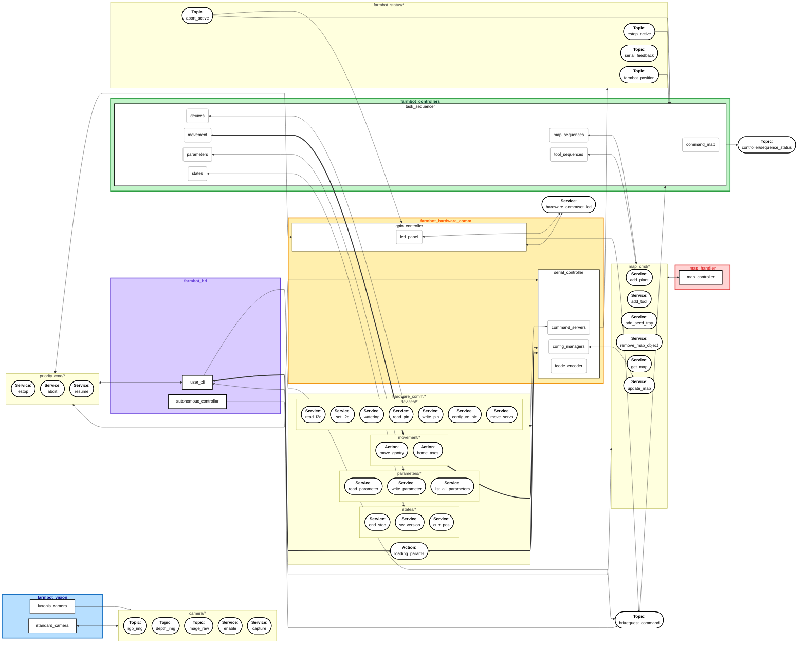

```mermaid
---
config:
  flowchart:
    nodeSpacing: 20
    rankSpacing: 30
    curve: monotoneX
---
flowchart LR;

    classDef node fill:#FFFFFF,stroke:#000,stroke-width:2px,color:#000
    classDef module fill:#FFFFFF,stroke:#808080,stroke-width:1px

    style VISION fill:#a5d8ff,fill-opacity:0.8,stroke:#1971c2,stroke-width:3px,color:#00008B
    style CONTROLLER fill:#b2f2bb,fill-opacity:0.8,stroke:#2f9e44,stroke-width:3px,color:#06402B
    style HARDWARE_COMM fill:#ffec99,fill-opacity:0.8,stroke:#f08c00,stroke-width:3px,color:#FF5C00
    style HRI fill:#d0bfff,fill-opacity:0.8,stroke:#6741d9,stroke-width:3px,color:#6741d9
    style MAP fill:#ffc9c9,fill-opacity:0.8,stroke:#e03131,stroke-width:3px,color:#e03131

    subgraph CONTROLLER["<b>farmbot_controllers</b>"]
        direction TB
        subgraph TASK_SEQUENCER["task_sequencer"]
            command_map_module("command_map")
            devices_module("devices")
            map_sequences_module("map_sequences")
            movement_module("movement")
            parameters_module("parameters")
            states_module("states")
            tool_sequences_module("tool_sequences")
            
        end
    end
    
    subgraph VISION["<b>farmbot_vision</b>"]
        direction TB
        luxonis_node["luxonis_camera"]
        standard_node["standard_camera"]
    end
    
    subgraph HARDWARE_COMM["<b>farmbot_hardware_comm</b>"]
        direction TB
        subgraph GPIO_NODE["gpio_controller"]
            led_panel_module("led_panel")
        end

        subgraph SERIAL_NODE["serial_controller"]
            direction TB
            command_servers_module("command_servers")
            config_managers_module("config_managers")
            fcode_encoder_module("fcode_encoder")
        end
    end
    
    subgraph MAP["<b>map_handler</b>"]
        direction TB
        map_node["map_controller"]
    end

    subgraph HRI["<b>farmbot_hri</b>"]
        direction TB
        user_cli_node["user_cli"]
        autonomous_node["autonomous_controller"]
    end

    request_command(["<b>Topic</b>:<br> hri/request_command"])

    sequence_status(["<b>Topic</b>:<br> controller/sequence_status"])

    set_led(["<b>Service</b>:<br> hardware_comm/set_led"])

    subgraph PRIORITY_CMD["priority_cmd/*"]
        direction TB
        estop(["<b>Service</b>:<br> estop"])
        abort(["<b>Service</b>:<br> abort"])
        resume(["<b>Service</b>:<br> resume"])
    end

    subgraph FB_STATUS["farmbot_status/*"]
        direction TB
        fb_position(["<b>Topic</b>:<br> farmbot_position"])
        estop_active(["<b>Topic</b>:<br> estop_active"])
        abort_active(["<b>Topic</b>:<br> abort_active"])
        serial_feedback(["<b>Topic</b>:<br> serial_feedback"])
    end

    subgraph HARDWARE_COMM_INTERFACES["hardware_comm/*"]
        direction TB
        loading_param(["<b>Action</b>:<br> loading_params"])

        subgraph HARDWARE_COMM_STATES["states/*"]
            end_stop(["<b>Service</b>:<br> end_stop"])
            sw_version(["<b>Service</b>:<br> sw_version"])
            curr_position(["<b>Service</b>:<br> curr_pos"])
        end
        subgraph HARDWARE_COMM_DEVICES["devices/*"]
            read_i2c(["<b>Service</b>:<br> read_i2c"])
            set_i2c(["<b>Service</b>:<br> set_i2c"])
            watering(["<b>Service</b>:<br> watering"])
            read_pin(["<b>Service</b>:<br> read_pin"])
            write_pin(["<b>Service</b>:<br> write_pin"])
            configure_pin(["<b>Service</b>:<br> configure_pin"])
            move_servo(["<b>Service</b>:<br> move_servo"])
        end
        subgraph HARDWARE_COMM_PARAMS["parameters/*"]
            read_param(["<b>Service</b>:<br> read_parameter"])
            write_param(["<b>Service</b>:<br> write_parameter"])
            list_all_param(["<b>Service</b>:<br> list_all_parameters"])
        end
        subgraph HARDWARE_COMM_MOVEMENT["movement/*"]
            move_gantry(["<b>Action</b>:<br> move_gantry"])
            home_axes(["<b>Action</b>:<br> home_axes"])
        end
    end

    subgraph MAP_CMD["map_cmd/*"]
        add_plant(["<b>Service</b>:<br> add_plant"])
        add_tool(["<b>Service</b>:<br> add_tool"])
        add_seed_tray(["<b>Service</b>:<br> add_seed_tray"])
        remove_map_object(["<b>Service</b>:<br> remove_map_object"])
        get_map(["<b>Service</b>:<br> get_map"])
        update_map(["<b>Service</b>:<br> update_map"])
    end

    subgraph CAMERA["camera/*"]
        rgb_img(["<b>Topic</b>:<br> rgb_img"])
        depth_img(["<b>Topic</b>:<br> depth_img"])
        image_raw(["<b>Topic</b>:<br> image_raw"])
        enable(["<b>Service</b>:<br> enable"])
        capture(["<b>Service</b>:<br> capture"])
    end


    autonomous_node ---> request_command

    PRIORITY_CMD <--> GPIO_NODE
    
    set_led <--> GPIO_NODE
    abort_active --> GPIO_NODE
    GPIO_NODE ---> request_command

    led_panel_module <--> set_led

    user_cli_node ---> request_command
    PRIORITY_CMD <--> user_cli_node

    user_cli_node <==> loading_param
    user_cli_node <--> MAP_CMD

    states_module <--> HARDWARE_COMM_STATES

    devices_module <--> HARDWARE_COMM_DEVICES

    parameters_module <--> HARDWARE_COMM_PARAMS

    movement_module <==> HARDWARE_COMM_MOVEMENT

    tool_sequences_module <--> MAP_CMD

    map_sequences_module <--> MAP_CMD

    fb_position --> TASK_SEQUENCER 
    estop_active --> TASK_SEQUENCER
    abort_active --> TASK_SEQUENCER
    request_command --> TASK_SEQUENCER
    TASK_SEQUENCER --> sequence_status

    HARDWARE_COMM_INTERFACES<--> command_servers_module

    config_managers_module <--> update_map

    HARDWARE_COMM_MOVEMENT <==> SERIAL_NODE
    loading_param <==> SERIAL_NODE
    PRIORITY_CMD <--> SERIAL_NODE
    SERIAL_NODE --> FB_STATUS

    MAP_CMD <--> map_node

    standard_node <--> CAMERA

    luxonis_node --> CAMERA


    class user_cli_node,autonomous_node node
    class TASK_SEQUENCER node
    class command_map_module,devices_module,map_sequences_module,movement_module,parameters_module,states_module,tool_sequences_module module
    class luxonis_node,standard_node node
    class GPIO_NODE,SERIAL_NODE node
    class led_panel_module,command_servers_module,config_managers_module,fcode_encoder_module module
    class map_node node

```